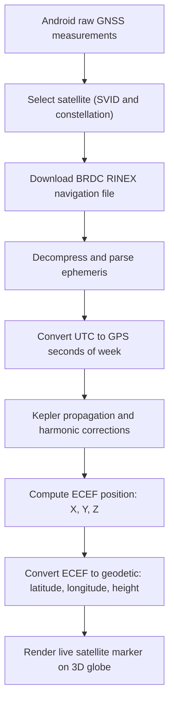
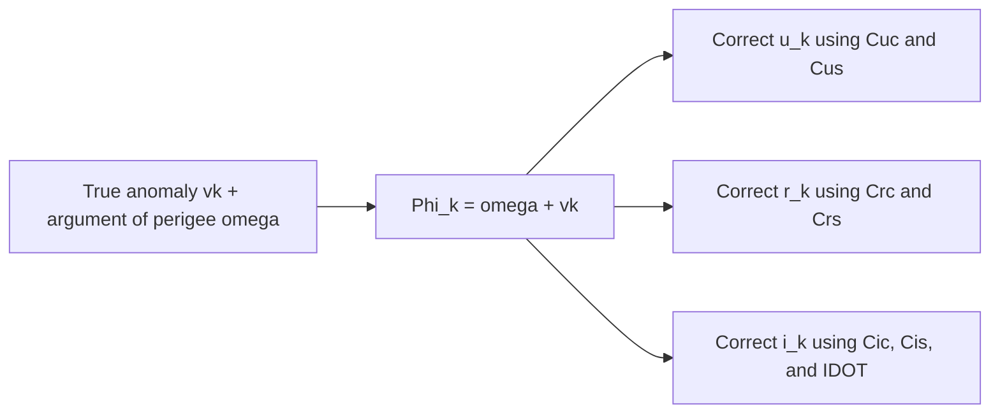
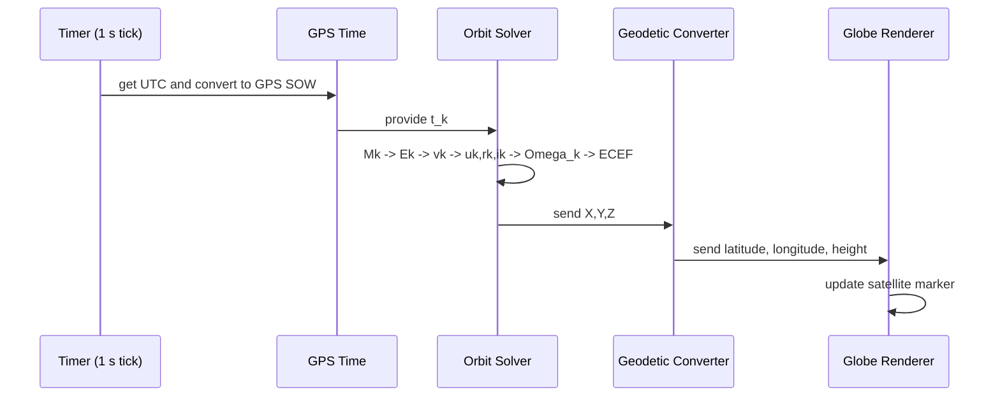
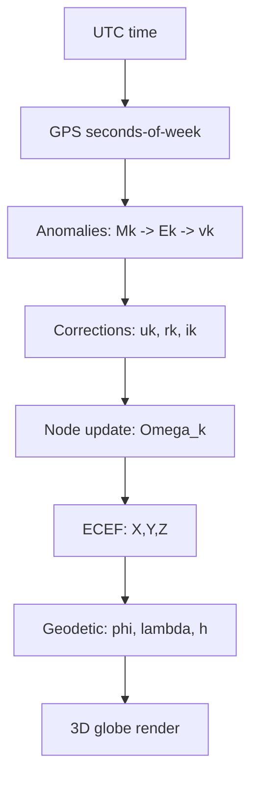

# Raw GNSS Signals to Live Satellite Coordinates

## Chapter 1: Why this topic is bigger than "GPS gives me location"
When people first hear about GPS, they are usually told a simple story: a phone talks to satellites and then shows a location on a map. That story is useful as a first mental model, but it hides the central engineering idea. A receiver cannot estimate user position unless it also knows where each satellite was when that satellite transmitted its signal. This means GNSS always contains two linked problems: estimating user state from measurements, and estimating satellite state from orbital parameters. This project started as a fun challenge for me: instead of only asking satellites "where am I?", I wanted to ask them "where are you right now?" In this blog, I explain that exact journey and the math pipeline I built.
Before going deeper, a quick definition: GNSS stands for Global Navigation Satellite System. It is the umbrella term for satellite constellations that provide positioning, navigation, and timing (PNT) services. GPS is one GNSS, but not the only one. Galileo, GLONASS, BeiDou, NavIC, and QZSS are also part of the broader GNSS ecosystem.

The core pipeline in this system is: navigation message to ephemeris parameters, ephemeris plus time to orbital propagation, propagation output to ECEF coordinates, and ECEF to geodetic coordinates for visualization. This is not just a chain of formulas. It is a sequence of frame changes and model assumptions, each one needed so that the next computation is meaningful.

Current scope note: the reliable propagation path in this implementation is GPS-focused. The app can list multiple constellations from Android GNSS measurements, but GLONASS propagation is explicitly not implemented in this branch, and the time/orbit path is currently structured around GPS-style assumptions.

Pipeline flow for this blog:

## Chapter 2: Why I use this data strategy on Android
After reading [Sean Barbeau's article on decoding Android GNSS navigation messages](https://barbeau.medium.com/decoding-android-gnss-navigation-messages-93bc62e2eb00), the key design reason becomes very clear. Android GNSS tooling can expose three different layers of information: NMEA output, raw GNSS measurements, and navigation messages (see Android docs for [GnssMeasurementsEvent](https://developer.android.com/reference/android/location/GnssMeasurementsEvent) and [GnssNavigationMessage](https://developer.android.com/reference/android/location/GnssNavigationMessage)). In theory, navigation messages are ideal because they include broadcast orbital content like ephemeris and clock terms. In practice, device support is uneven. The article shows that while NMEA and raw measurements are widely available, navigation-message logging is supported on far fewer phones, which makes a "decode everything directly from the handset" approach fragile if the goal is to build a reliable workflow that works across devices.

The second reason is decoding complexity. Even when navigation messages are available, the data arrives as raw bytes and each constellation/signal has its own message structure. That means parsing logic is not one universal decoder; it becomes constellation-specific and signal-specific, with bit packing details that differ between GPS L1 C/A, GLONASS strings, Galileo pages, and others. So if I make Chapter 2 only about "read nav message and done," I hide a major engineering constraint from learners. The real situation is that raw Android observables and direct navigation decoding are not equally accessible on all hardware.

That is exactly why I do what I do in this project. In `lib/main.dart`, I use raw measurement streams to identify satellites in view and track live signal context, because that layer is broadly usable. Then in `lib/satellite_detail_page.dart`, I fetch BRDC RINEX navigation data from IGS, decompress it, and parse ephemeris in a controlled format. This gives me deterministic propagation inputs independent of whether a specific phone exposes full navigation-message support. In other words, the phone tells me "which satellite I am seeing now," and the RINEX ephemeris provides "the orbital model parameters I need to compute where it is."

This design is also consistent with the assisted-GNSS idea discussed in the article: receivers do not always need to decode every piece of navigation data over-the-air in real time if equivalent assistance/ephemeris data can be obtained from network sources. For my educational pipeline, the hybrid approach is the most transparent and reproducible path. It lets me teach each computational step clearly while avoiding device-specific API gaps that would otherwise block the full orbit-to-visualization chain.
## Chapter 3: Ephemeris, RINEX, PRN, and constellation mapping
Ephemeris is a compact, time-referenced parameter set for one satellite. It is not a fixed position; it is a model input that becomes position only after propagation at a specific epoch. In `lib/utils/ephemeris_parser.dart`, I parse these values into an `Ephemeris` object that includes orbital shape terms, phase terms, harmonic corrections, and node/inclination dynamics.

RINEX uses constellation prefixes like `G` and `E`, while Android reports constellation type and `svid`. So I map Android identifiers to RINEX prefixes first, then locate the matching PRN block. That parsing step is a coordinate-system identity alignment in data format space, not in geometric space, but it is still essential.

I also keep an explicit boundary for GLONASS in this path. In my current implementation, GLONASS returns `null` in this Kepler-style branch because its broadcast model differs from GPS/Galileo-style equations used here.

## Chapter 4: Time systems in GNSS and why leap seconds matter
GNSS propagation is fundamentally time-driven. In `lib/utils/gps_time.dart`, I convert UTC to GPS time by applying the configured leap-second offset and then computing GPS seconds of week.
What time am I calculating here? I am calculating two time quantities for two different purposes. First, I calculate the current epoch in GPS time, represented as GPS seconds-of-week. That is the time coordinate used to evaluate broadcast orbit equations at "now." Second, I calculate \(t_k\), which is the relative time offset from the ephemeris reference epoch \(t_{oe}\). So GPS seconds-of-week gives the absolute position on the GPS clock within the week, while \(t_k\) gives the model-specific "time since reference" used for propagation.

What is GPS time? GPS time is a continuous satellite-system timescale that starts at the GPS epoch (1980-01-06). Unlike UTC, it does not insert leap seconds in the same way civil time does. Because of this, UTC and GPS time differ by an offset, and I explicitly apply that offset before propagation. In simple terms: I read time from UTC, convert it into GPS system time, then use that converted time to compute satellite position.

\[
t_{\mathrm{GPS,week}} = \left( t_{\mathrm{UTC}} + \Delta t_{\mathrm{leap}} - t_{\mathrm{GPS\ epoch}} \right) \bmod 604800
\]

- \(t_{\mathrm{GPS,week}}\): GPS seconds of week.
- \(t_{\mathrm{UTC}}\): current UTC epoch.
- \(\Delta t_{\mathrm{leap}}\): GPS-UTC offset in seconds.
- \(t_{\mathrm{GPS\ epoch}}\): GPS epoch (1980-01-06T00:00:00Z).
- \(604800\): seconds in one GPS week.

For ephemeris propagation, I use time since ephemeris reference epoch:

\[
t_k = t - t_{oe}
\]

- \(t_k\): propagation interval relative to ephemeris reference.
- \(t\): current GPS time (seconds of week).
- \(t_{oe}\): ephemeris reference time.

To handle week rollover continuity, I apply:

\[
\text{if } t_k > 302400,\quad t_k \leftarrow t_k - 604800
\]
\[
\text{if } t_k < -302400,\quad t_k \leftarrow t_k + 604800
\]

- \(302400\): half GPS week.
- Continuity correction prevents artificial jumps near week boundaries.

## Chapter 5: What orbital anomalies are, and why GNSS uses them
In orbital mechanics, an anomaly is an angle used to specify where a satellite is along its orbit at a given time. The word sounds like "error," but here it means "orbital angle coordinate." GNSS uses three linked anomalies because each one solves a different problem. Mean anomaly is best for time evolution, eccentric anomaly is best for solving Kepler's equation, and true anomaly is best for geometric position on the real ellipse. Together, they create a practical bridge from time to position.

A helpful way to think about the three anomalies is that they are three coordinate languages for the same point on orbit. Mean anomaly is the uniform-time language, eccentric anomaly is the solver-friendly language, and true anomaly is the physical-geometry language. My code in `lib/steps/1_gnss_anomalies.dart` moves through exactly this chain.

For visual intuition, this diagram shows mean, eccentric, and true anomaly on a Kepler ellipse:

The anomaly pipeline used in propagation is:

\[
M_k \xrightarrow{\text{solve Kepler}} E_k \xrightarrow{\text{ellipse geometry}} v_k
\]

To compute mean anomaly, I first recover semi-major axis from broadcast ephemeris:

\[
A = \left(\sqrt{A}\right)^2
\]

Then nominal and corrected mean motion are:

\[
n_0 = \sqrt{\frac{\mu}{A^3}}, \qquad n = n_0 + \Delta n
\]

Finally, mean anomaly at epoch \(t_k\) is:

\[
M_k = M_0 + n\,t_k
\]

- \(A\): semi-major axis.
- \(\mu\): Earth's gravitational parameter.
- \(n_0\): nominal mean angular rate.
- \(\Delta n\): broadcast correction to mean motion.
- \(M_0\): mean anomaly at reference epoch.
- \(M_k\): mean anomaly at current epoch.

The key meaning of mean anomaly is this: it behaves like a clean orbital clock angle that increases almost linearly with time. It does not directly give the true geometric angle on the ellipse, but it gives the right time progression required for the next step.

## Chapter 6: Eccentric anomaly, Kepler's equation, and why iteration is necessary
Eccentric anomaly \(E_k\) is the middle language between the time-clock variable \(M_k\) and the real geometric variable \(v_k\). Geometrically, \(E_k\) is measured from the center of the ellipse using the auxiliary circle construction. This is why it is not the same as true anomaly, which is measured from the focus (Earth in this model).

The link between \(M_k\) and \(E_k\) is Kepler's equation:

\[
M_k = E_k - e\sin(E_k)
\]

- \(e\): eccentricity (shape parameter of ellipse).
- \(M_k\): time-evolved mean anomaly.
- \(E_k\): eccentric anomaly to be solved.

This equation is transcendental because \(E_k\) appears both linearly and inside a sine term. That is why I cannot isolate \(E_k\) with simple algebra. In practical GNSS software, the standard approach is Newton-Raphson iteration, which is exactly what I implement.

I define residual and derivative:

\[
f(E) = E - e\sin(E) - M_k
\]
\[
f'(E) = 1 - e\cos(E)
\]

Then iterate:

\[
E_{i+1} = E_i - \frac{f(E_i)}{f'(E_i)}
\]

- \(f(E_i)\): current equation error (how far from zero).
- \(f'(E_i)\): local slope used to correct the guess.
- \(E_i\): current guess.
- \(E_{i+1}\): improved guess.

Interpretation: each iteration asks "how wrong is my current angle?" and then uses slope information to jump closer to the root. For GNSS broadcast orbits, eccentricity is usually small, so this converges quickly and stably in normal operation.

## Chapter 7: True anomaly, physical position angle, and orbital intuition
True anomaly \(v_k\) is the physically intuitive angle most people expect when they ask "where is the satellite on the ellipse right now?" It is measured at the focus, from periapsis to the current satellite position. This is the geometric orbit-position angle used in later orbital-plane coordinate equations.

After solving \(E_k\), I convert to \(v_k\) using:

\[
\sin(v_k) = \frac{\sqrt{1-e^2}\sin(E_k)}{1-e\cos(E_k)}
\]
\[
\cos(v_k) = \frac{\cos(E_k)-e}{1-e\cos(E_k)}
\]
\[
v_k = \operatorname{atan2}\!\left(\sin(v_k),\cos(v_k)\right)
\]

- Numerator terms encode ellipse-shape-adjusted projection.
- Denominator \(1-e\cos(E_k)\) appears from ellipse focus geometry.
- \(\operatorname{atan2}\) is essential because it preserves the correct quadrant.

A deeper physical intuition is speed variation along the ellipse. The satellite moves faster near periapsis and slower near apoapsis. Mean anomaly does not show that non-uniform motion directly because it advances almost uniformly in time. True anomaly does show the actual geometric phase where this speed variation is visible.

Another useful relation (used downstream when computing radius) is:

\[
r_k = A\left(1 - e\cos(E_k)\right)
\]

- \(r_k\): instantaneous orbital radius from Earth center to satellite.
- This equation shows why \(E_k\) is not just an intermediate math trick; it directly controls orbital distance, which then feeds position coordinates.

So the practical meaning of the anomaly chain in GNSS is: \(M_k\) gives time-consistent phase, \(E_k\) gives solver-friendly ellipse parameterization, and \(v_k\) gives real geometric orbit angle for position computation.

## Chapter 8: Harmonic corrections and why the broadcast orbit is not a perfect ellipse
Up to Chapter 7, the orbit model is still close to an ideal Kepler ellipse. In the real [GNSS broadcast orbit model](https://gssc.esa.int/navipedia/index.php/GNSS_Broadcast_Orbits), that is not enough for good positioning. Satellites are affected by perturbing forces and modeling approximations, so navigation messages include harmonic correction coefficients that nudge the ideal solution toward the actual broadcast trajectory. This is exactly what I compute in `lib/steps/2_orbital_plane.dart`.

A good intuition is to think of the Kepler ellipse as the base melody and harmonic terms as fine tuning. The base gives the dominant shape and period, and the harmonic corrections add periodic adjustments to angle, radius, and tilt. Without these corrections, the propagated position can drift enough to matter in downstream geometry. This is the part where orbital math stops being "textbook neat" and starts being realistically messy, in a good way.

The intermediate phase is:

\[
\Phi_k = \omega + v_k
\]

Corrected argument of latitude:

\[
u_k = \Phi_k + C_{uc}\cos(2\Phi_k) + C_{us}\sin(2\Phi_k)
\]

Corrected radius:

\[
r_k = A\left(1-e\cos(E_k)\right) + C_{rc}\cos(2u_k) + C_{rs}\sin(2u_k)
\]

Corrected inclination:

\[
i_k = i_0 + \dot{i}\,t_k + C_{ic}\cos(2u_k) + C_{is}\sin(2u_k)
\]

- \(u_k\): corrected argument of latitude, angular position inside the orbital plane.
- \(r_k\): corrected orbital radius, Earth-center to satellite distance.
- \(i_k\): corrected inclination, orbital-plane tilt relative to equator.
- \(C_{uc}, C_{us}\): latitude harmonic correction coefficients.
- \(C_{rc}, C_{rs}\): radial harmonic correction coefficients.
- \(C_{ic}, C_{is}\): inclination harmonic correction coefficients.
- \(\dot{i}\): inclination-rate term from ephemeris.

Conceptually, this chapter is where the model moves from "ideal orbit mathematics" to "navigation-grade broadcast orbit modeling."

## Chapter 9: Orbital-plane coordinates and RAAN orientation in Earth context
After Chapter 8, I know the corrected in-plane angle \(u_k\), corrected radius \(r_k\), and corrected inclination \(i_k\). But the satellite is still described in orbit-local terms. I now need to orient that local orbit in an Earth-referenced geometry. This chapter does two things: first, it computes local orbital-plane coordinates \((x', y')\), then it computes the corrected node angle \(\Omega_k\), which rotates the orbital plane into Earth-referenced orientation.

For intuition, this orbital-elements diagram helps connect inclination and node angles:

Local orbital-plane coordinates are:

\[
x' = r_k\cos(u_k), \qquad y' = r_k\sin(u_k)
\]

- \(x'\), \(y'\): coordinates in the orbital plane.
- Prime notation means "orbital-frame", not Earth-fixed.

Corrected right ascension of ascending node is:

\[
\Omega_k = \Omega_0 + \left(\dot{\Omega} - \omega_E\right)t_k - \omega_E t_{oe}
\]

- \(\Omega_k\): node longitude used at current epoch.
- \(\Omega_0\): node longitude at reference epoch.
- \(\dot{\Omega}\): node-rate term from ephemeris.
- \(\omega_E\): Earth rotation rate.

The \(-\omega_E\) terms are crucial. Earth rotates while the satellite moves, so Earth-fixed orientation must include Earth rotation explicitly. This chapter is the "frame orientation" bridge between orbit-local geometry and Earth-fixed coordinates.

## Chapter 10: Transforming orbital coordinates to ECEF (the Earth-fixed 3D result)
Now I take orbit-local coordinates \((x', y')\) and transform them into ECEF \((X, Y, Z)\), which is the frame used by mapping and geodetic conversion (same propagation sequence as the [GPS and Galileo Satellite Coordinates Computation](https://gssc.esa.int/navipedia/index.php/GPS_and_Galileo_Satellite_Coordinates_Computation) reference). In `lib/steps/5_ecef.dart`, this is the core coordinate transformation stage.

For frame intuition, this ECEF diagram is useful:

Component equations are:

\[
X = x'\cos(\Omega_k) - y'\cos(i_k)\sin(\Omega_k)
\]
\[
Y = x'\sin(\Omega_k) + y'\cos(i_k)\cos(\Omega_k)
\]
\[
Z = y'\sin(i_k)
\]

The three scalar equations above are exactly what I use in code, and they are equivalent to the compact matrix form.

- \(X,Y,Z\): Earth-centered Earth-fixed Cartesian coordinates in meters.
- \(\Omega_k\): node orientation in Earth-fixed context.
- \(i_k\): corrected inclination.

The chapter meaning is simple but fundamental: this is where abstract orbit geometry becomes a concrete, Earth-fixed 3D point. This is also my favorite transition in the pipeline, because this is where equations finally "land" on Earth coordinates.

## Chapter 11: ECEF to geodetic conversion, Earth shape, and latitude meaning
Humans understand latitude/longitude/height better than Cartesian \((X,Y,Z)\), so this chapter converts ECEF to geodetic coordinates in `lib/steps/6_geodetic.dart`. The hard part is Earth shape. If Earth were a perfect sphere, conversion would be much simpler. But WGS-84 models Earth as an oblate ellipsoid, so latitude definitions split into different types.

This figure helps with geodetic vs geocentric latitude intuition:

WGS-84 constants:

\[
f = \frac{1}{298.257223563}, \qquad b = a(1-f), \qquad e^2 = 2f - f^2
\]

- \(a\): semi-major axis.
- \(b\): semi-minor axis.
- \(f\): flattening.
- \(e^2\): first eccentricity squared.

Initial geometry:

\[
p = \sqrt{X^2 + Y^2}, \qquad \lambda = \operatorname{atan2}(Y,X)
\]

- \(p\): distance from Earth rotation axis.
- \(\lambda\): longitude.

Iterative Bowring-style update:

\[
N(\phi) = \frac{a}{\sqrt{1-e^2\sin^2(\phi)}}
\]
\[
h = \frac{p}{\cos(\phi)} - N(\phi)
\]
\[
\phi \leftarrow \operatorname{atan2}\!\left(Z,\;p\left(1-\frac{e^2N(\phi)}{N(\phi)+h}\right)\right)
\]

- \(\phi\): geodetic latitude.
- \(N(\phi)\): prime vertical radius of curvature.
- \(h\): ellipsoidal height.

This chapter's core message: coordinate conversion is not cosmetic. It is a geometric model change from Cartesian space to ellipsoidal geodesy.

## Chapter 12: Real-time propagation loop, state updates, and rendering scale
In `lib/globe_page.dart`, I run the full chain every second. This means each marker update is computed from current time and ephemeris, not replayed from a stored animation path. The app is continuously solving the orbit state pipeline in real time, so what you see is live propagation, not decorative animation.

For altitude rendering, I normalize height:

\[
h_{\mathrm{scaled}} = \frac{h}{R_E}
\]

- \(h\): physical ellipsoidal height in meters.
- \(R_E\): Earth reference radius used by scene scale.
- \(h_{\mathrm{scaled}}\): rendering-friendly altitude.

## Chapter 13: Velocity, heading, and ground-track intuition from propagated states
After position is stable, the next learning step is motion. Velocity can be estimated numerically from consecutive propagated states. The simplest forward-difference estimate is:

\[
\mathbf{v}(t) \approx \frac{\mathbf{r}(t+\Delta t)-\mathbf{r}(t)}{\Delta t}
\]

A better symmetric estimate is:

\[
\mathbf{v}(t) \approx \frac{\mathbf{r}(t+\Delta t)-\mathbf{r}(t-\Delta t)}{2\Delta t}
\]

Speed magnitude is:

\[
\|\mathbf{v}\| = \sqrt{v_X^2 + v_Y^2 + v_Z^2}
\]

- \(\mathbf{r}(t)\): ECEF position vector.
- \(\mathbf{v}(t)\): estimated ECEF velocity vector.
- \(\Delta t\): sampling interval.

For map heading between two geodetic points \((\phi_1,\lambda_1)\) and \((\phi_2,\lambda_2)\), a common initial bearing formula is:

\[
\theta = \operatorname{atan2}\!\left(\sin\Delta\lambda\cos\phi_2,\;\cos\phi_1\sin\phi_2 - \sin\phi_1\cos\phi_2\cos\Delta\lambda\right)
\]

- \(\Delta\lambda = \lambda_2 - \lambda_1\)
- \(\theta\): initial bearing angle.

Ground-track intuition GIF:

This chapter's idea is that motion is not a separate data source in my current stack; it is derived from time-evolving propagated position.

## Chapter 14: Full synthesis, interpretation, and what the pipeline really computes
At this point, the complete computational story is a chain of model transformations driven by time:

\[
\left(t_{\mathrm{UTC}}\right) \rightarrow \left(t_{\mathrm{GPS}}\right) \rightarrow \left(M_k,E_k,v_k\right) \rightarrow \left(u_k,r_k,i_k,\Omega_k\right)
\]
\[
\rightarrow \left(x',y'\right) \rightarrow \left(X,Y,Z\right)_{\mathrm{ECEF}} \rightarrow \left(\phi,\lambda,h\right)_{\mathrm{WGS84}} \rightarrow \text{rendered satellite state}
\]

- Time-system transformation ensures epoch consistency.
- Anomaly chain maps time to ellipse phase.
- Harmonic and node corrections map ideal orbit to broadcast model.
- ECEF transform maps orbit-local geometry into Earth-fixed coordinates.
- Geodetic transform maps Cartesian state into map-friendly coordinates.

A compact architecture diagram for the same story is:

This is the main takeaway I want readers to keep: when we say "ephemeris to map point," we are really talking about a carefully ordered sequence of time handling, orbital dynamics, frame transformations, and Earth-shape geometry. The quality of the final point on screen depends on getting every one of those layers right. It began as a fun project, but the result is a serious end-to-end GNSS computation pipeline.

## References
1. [Earthdata: Broadcast Ephemeris Data Product](https://www.earthdata.nasa.gov/data/space-geodesy-techniques/gnss/broadcast-ephemeris-data-product)
2. [ESA Navipedia: GNSS Broadcast Orbits](https://gssc.esa.int/navipedia/index.php/GNSS_Broadcast_Orbits)
3. [ESA Navipedia: GPS and Galileo Satellite Coordinates Computation](https://gssc.esa.int/navipedia/index.php/GPS_and_Galileo_Satellite_Coordinates_Computation)
4. [Geographic coordinate conversion](https://en.wikipedia.org/wiki/Geographic_coordinate_conversion)
5. [Sean Barbeau: Decoding Android GNSS Navigation Messages](https://barbeau.medium.com/decoding-android-gnss-navigation-messages-93bc62e2eb00)
6. [Android API: GnssMeasurementsEvent](https://developer.android.com/reference/android/location/GnssMeasurementsEvent)
7. [Android API: GnssNavigationMessage](https://developer.android.com/reference/android/location/GnssNavigationMessage)
8. Project repository: [LiveSAT-GNSS](https://github.com/HarshKishorani/LiveSAT-GNSS)